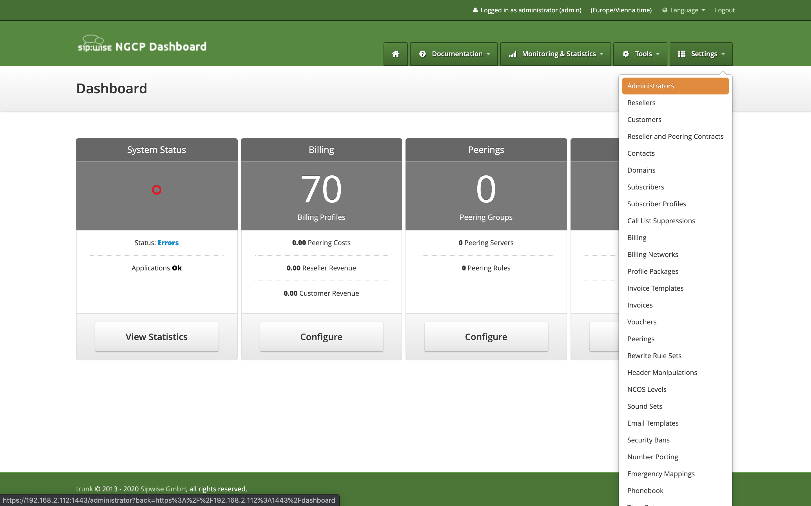
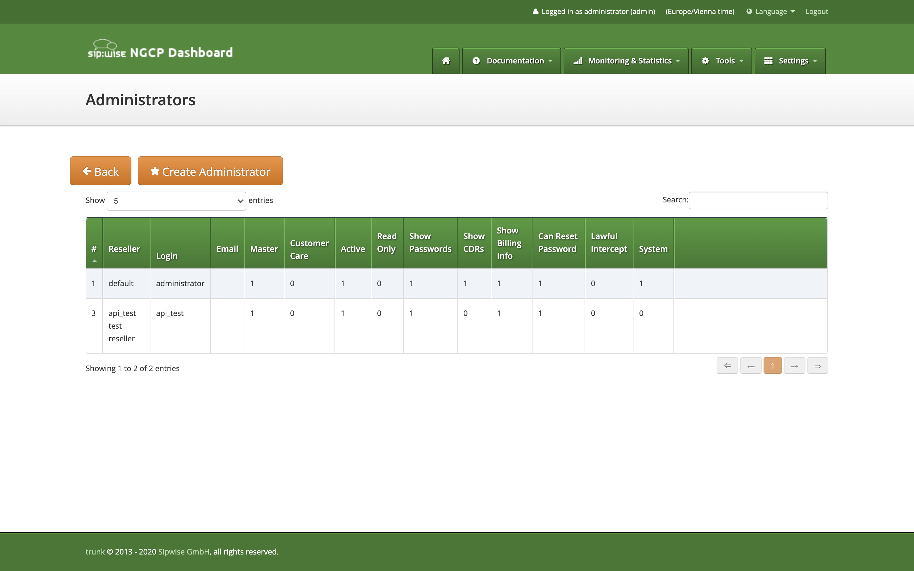

# Contribution

The goal of this project is to migrate the old Sipwise VoIP management web interface, which is written in Perl, to a modern web technology stack.
Since we are active in the Open Source community for years now, we would like to make the contribution process as easy as possible. Therefore, we would like to share some concepts and publish a guideline how to step into development fast.

## Definitions

### Module
A "module" is a feature which can be reached over the main menu. The main menu categorises the main functionality under the menu point "Settings".

(Main menu in the old panel)

## Strategy
The idea is to use the current implementation as blueprint and as fallback. Fallback means that as longs as we do not have a new implementation for a module, we proxy the old functionality through an iframe.

## Component framework
To make the life easier and migration fast, we are going to provide some key components, which are supposed to cover most of the functionality in the old implementation.

### EntityListPage
The first important component is the EntityListPage. It represents a single page which contains a single data table.

(Data table in the old panel)

