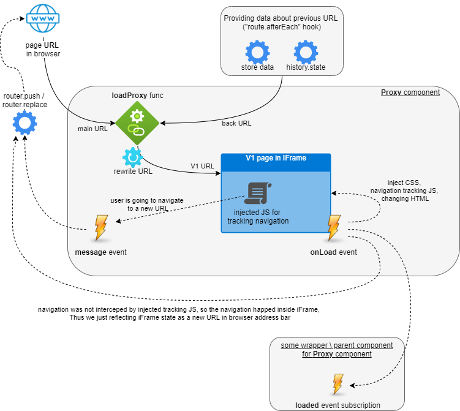
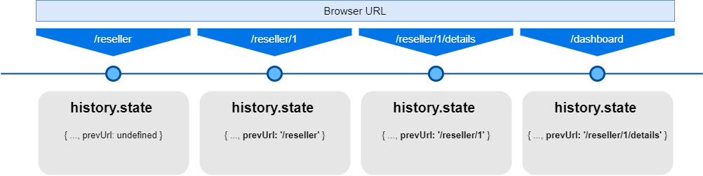
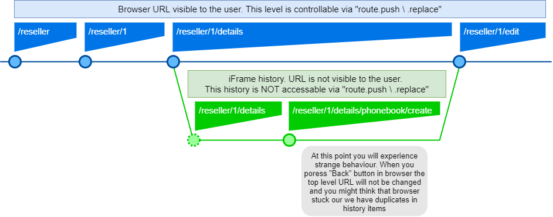
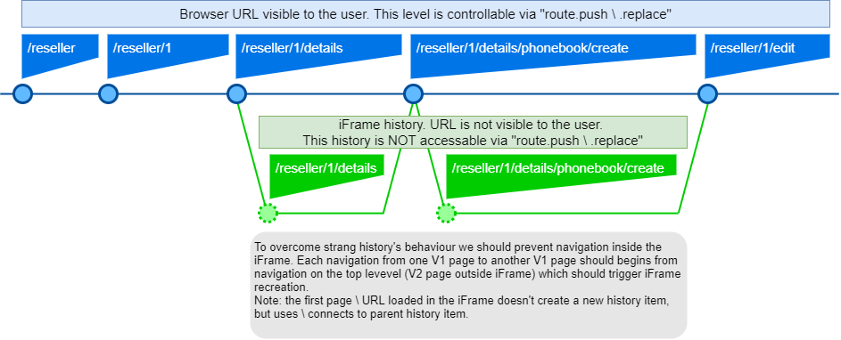

#Proxy Component

The purpose of the component is to provide ability to display and partially integrate
the pages form old NgcpPanel (V1) to the Admin UI interface (V2).

To display V1 pages as part of V2 we are using IFrame and the additional JS code around it
to help V1 pages look and behave more natural and consistent with V2 pages.

On the **image below** you can see the main element of the component and their relations:

## More details

### Utilizing "history.state"

History browser API does not allow reading URL of history items except current one. So, we are utilizing "history.state" object to hold the correct value of previously visited page (URL of the previous item in the history).
It provides more accurate "backUrl" for V1. That value stays stable even if we are pressing Back and Forward buttons in browser several times.

On the **image below** you can see the example of "history.state" data assigned to each history item when we are going through pages.

### Duplicates in history

iFrame pushes a new state\history item every time you change "src" attr OR
perform a navigation inside the iFrame. The only exception is when the iFrame is blank and we are
loading some "src" first time, in this case no new history item will be added.

       Classical workflow with an issue "doubling browser history records" is next:
       * we are on a page with a loaded page in iFrame (part of our Proxy component) -->
         --> we are changing URL by typing new one in browser OR just clicking on some MainMenu link -->
         --> vue-router tracks change (+1 history item) -->
         --> VUE reuses the same Proxy component but requesting iFrame.src change in already loaded iFrame -->
         --> new "src" URL is loaded in iFrame (+1 history item)

       So, changing "key" property for iFrame will force VUE to recreate our iFrame DOM element
       so we will not have an extra history item. :-)

On the **image below** you could find browser history items visualization when you have iFrame on your page. Circles on the picture are history items. The history items represented in browser UI as dropdown list of items \ steps attached to "Back" and "Forward" buttons.

Note: when user tries to navigate "Back" the browser reads data from the history item and tries to apply that URL to a target (main window or a frame), even if it's an iFrame which is not in DOM anymore.
* If iFrame was moved to another place in DOM, the browser considers it like a frame with another target ID
* Removing iFrame from the DOM does not remove history items associated with that iFrame (target)
* if you have a new history item produced by iFrame, and you will try to change browser URL to reflect current state of the URL from iFrame via "route.replace", it will just replace URL in history item associated with iFrame initialization. For example: On the image above, if you try to update "/reseller/1/details" to "/reseller/1/details/phonebook/create" it will actually just replace "/reseller/1/details" history item with a new value but introduce a new history item on the main page context (blue line).

On the **image below** you could find browser history items visualization with current implementation of Proxy component.

### Recommended test-cases
When you change something in Proxy's code it is highly recommended to check next test cases:
1) URL changed in the main window, Proxy(URL 1) page -> Proxy (URL 2) page.
   The parent components for the routes are the same. (Proxy component will be reused)
   For example: clicking main menu items for two not migrated pages yet. "Dashboard --> Subscribers"
2) URL changed in the main window, Proxy(URL 1) page -> WrapperComponent(Proxy (URL 2)) page.
   The parent components for the routes are NOT the same. (Proxy component will be re-created)
   For example: switching from Proxy page from MainMenu and a Proxy page with breadcrumbs wrapper.
   "a Reseller Details\branding (/v2/#/reseller/1/details/branding) --> Subscribers"
3) URL changed by iFrame internal navigation, Proxy(URL 1 -> URL 2) page.
   For example: open any not migrated page and click on any button which leads to not migrated page yet.
   "Dashboard -> Peering button"
4) (#2 + #3 cases) URL changed inside the iFrame, but we are trying to open partially migrated page with
   a Proxy wrapped with another component.
   For example: "Subscribers -> "customer" button on a row (Customer details page has breadcrumbs)"
